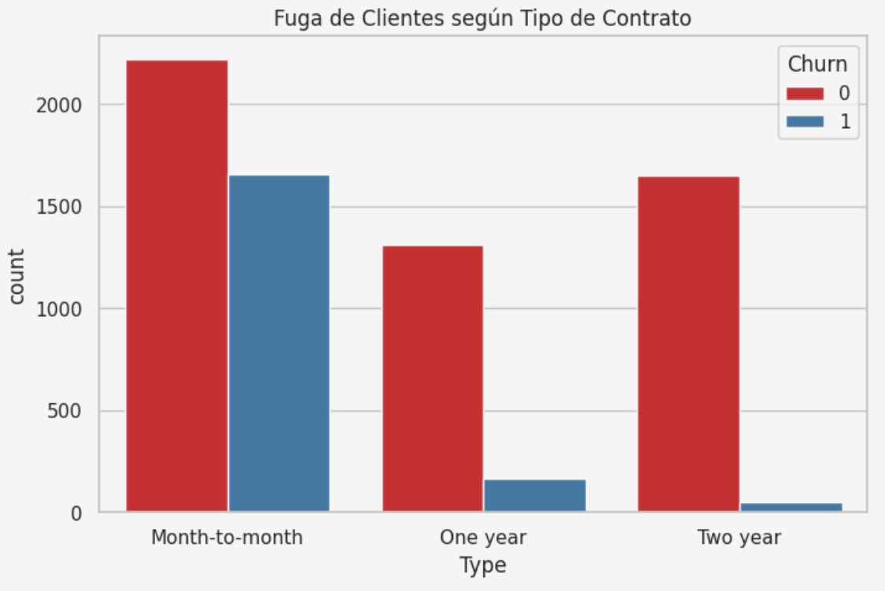
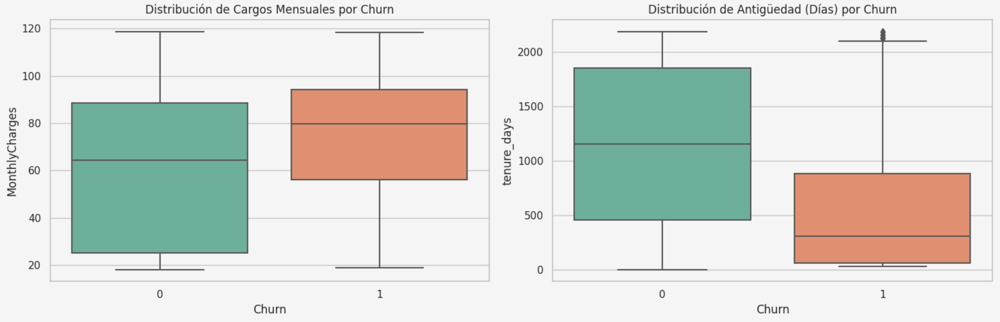

# Optimización de Retención B2C: Predicción de Churn mediante Machine Learning

## 1. Desafío de Negocio (Define)
La pérdida de clientes (*Churn*) representa una fuga de capital directo y un incremento en el Costo de Adquisición de Clientes (CAC). El objetivo de este proyecto es transicionar de una retención reactiva a una **retención proactiva**, desarrollando un modelo predictivo capaz de identificar anticipadamente a los usuarios en riesgo de abandono.

**KPI Objetivo:** Maximizar el *F1-Score* (> 0.80) para equilibrar la precisión en la detección y minimizar el costo de falsos positivos en campañas de retención.

## 2. Análisis de Causa Raíz (Analyze)
Antes del modelado predictivo, el análisis de datos reveló los principales cuellos de botella en la retención de la base instalada:

### Riesgo Operativo por Tipo de Contrato
Se identificó que el modelo de negocio es altamente vulnerable en los esquemas de corto plazo. La inmensa mayoría de la fuga de clientes se concentra en los contratos "Mes a Mes" (*Month-to-month*), indicando una falta de "candados" de fidelidad o problemas de satisfacción temprana.

### Perfil de Riesgo: Cargos vs. Antigüedad
Al evaluar la dispersión operativa, detectamos que el abandono está correlacionado con dos variables críticas:
1. **Facturación:** Los clientes que abandonan tienen una mediana de cargos mensuales significativamente más alta (~$80 USD).
2. **Ciclo de Vida:** La ventana de mayor riesgo (cuello de botella de retención) ocurre en los primeros 500 días de antigüedad.

## 3. Solución Técnica y Modelado (Improve & Control)
Para automatizar la detección de estos perfiles de riesgo, se construyó un *pipeline* de Machine Learning:

*   **Preprocesamiento:** Escalado estándar para variables numéricas y codificación OHE para variables categóricas, evitando *Data Leakage*.
*   **Modelo Final:** Ensamble de Gradient Boosting (`LightGBM`) ajustado para manejar desbalanceo de clases.
*   **Resultados de Producción:** 
    *   **ROC-AUC:** 0.8930 (Excelente capacidad de separación de clases).
    *   **F1-Score:** 0.6944 (Alcanzado mediante optimización de umbral de decisión a 0.60 para balancear Precisión y Recall).

## 4. Stack Tecnológico
*   **Lenguaje:** Python 3
*   **Manipulación de Datos:** Pandas, NumPy
*   **Machine Learning:** Scikit-learn, LightGBM

## 5. Arquitectura de Despliegue (AWS EC2)
El modelo está industrializado mediante **FastAPI** y empaquetado en un contenedor de **Docker**. El archivo `deploy_ec2.sh` contiene la automatización de infraestructura (*Infrastructure as Code*) diseñada para levantar el microservicio de manera instantánea en instancias **AWS EC2**, permitiendo que los sistemas corporativos (CRM/ERP) consuman las predicciones en tiempo real vía HTTP.
